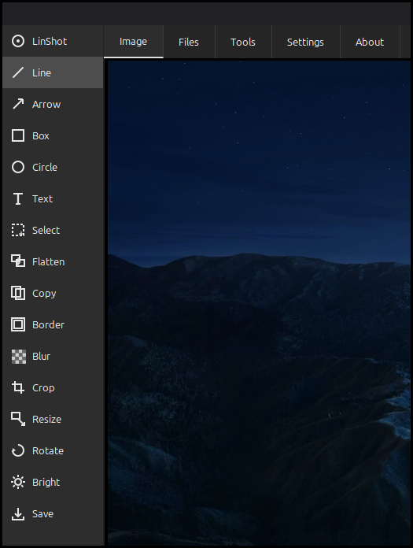
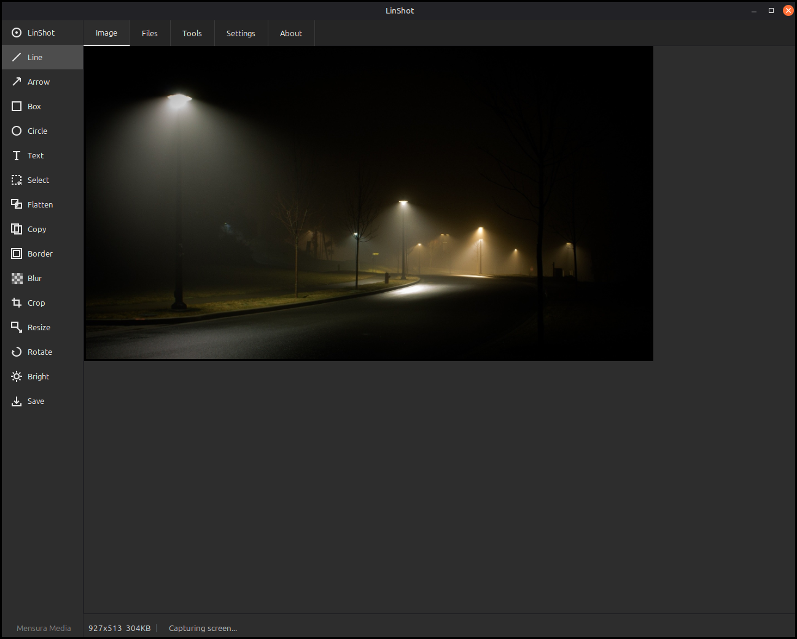
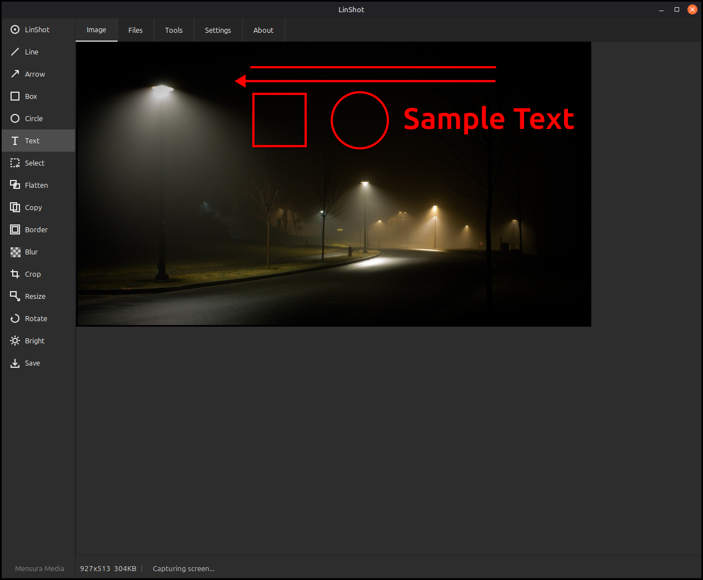
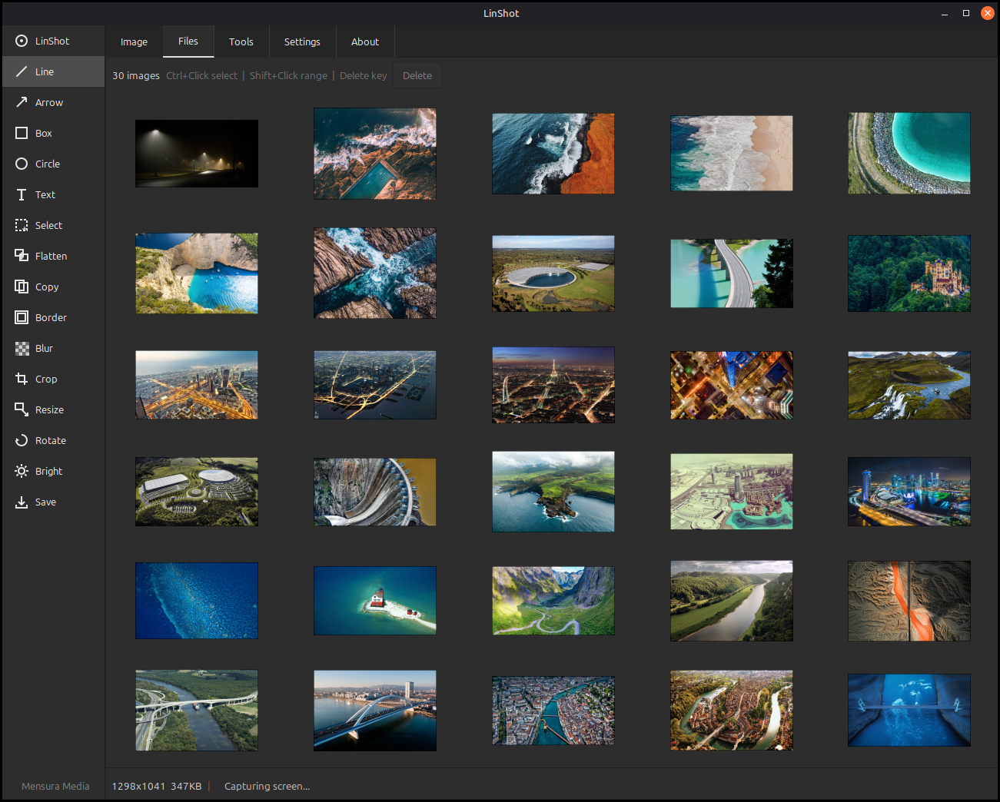
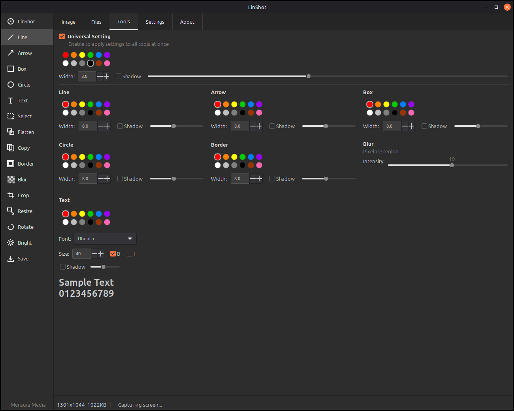
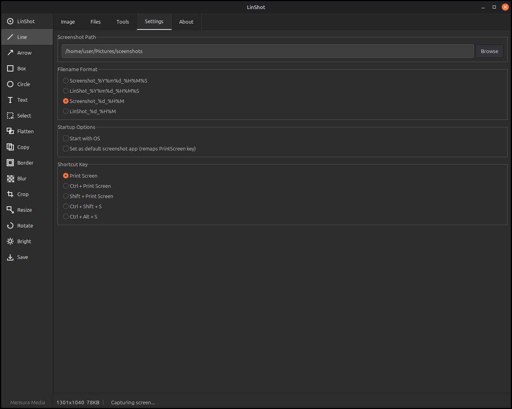
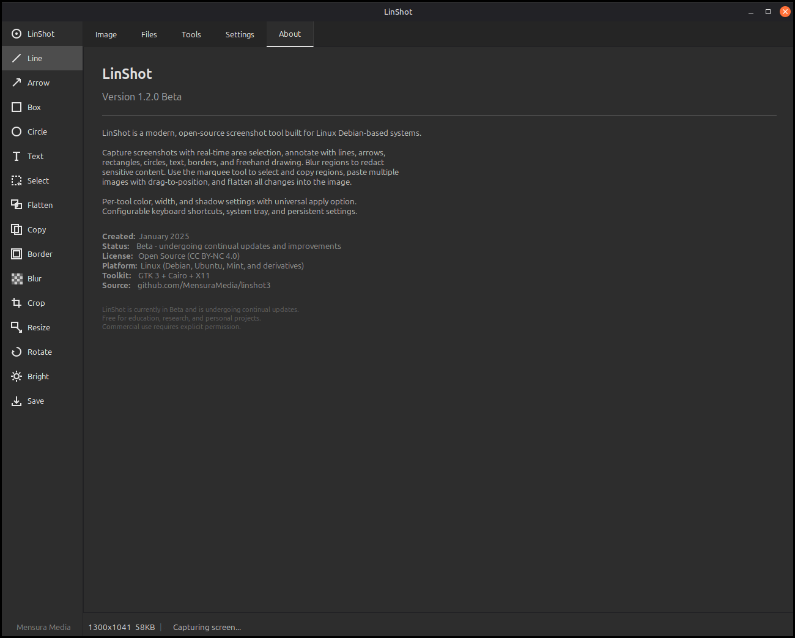

# LinShot

LinShot is a modern, open-source screenshot tool built for Linux Debian-based systems. Capture screenshots with real-time area selection, annotate with a full suite of drawing tools, and browse your image files — all from a clean, dark-themed interface.

**Version:** 1.4.0 Beta
**Created:** January 2025

## Quick Install (One Command)

```bash
git clone https://github.com/MensuraMedia/linshot3.git && bash linshot3/install.sh
```

Installs dependencies, builds, and sets up desktop integration. Works on Debian, Ubuntu, Linux Mint, Pop!_OS, and derivatives. See [INSTALL.md](INSTALL.md) for other methods or [KNOWN_ISSUES.md](KNOWN_ISSUES.md) for keybinding notes.

## Screenshots

### Sidebar — 16 Tools at a Glance


The sidebar provides instant access to every tool in LinShot:

- **LinShot** — Capture a new screenshot (area selection with crosshair)
- **Line** — Draw straight lines with configurable width and color
- **Arrow** — Draw filled arrows (Shift+drag snaps to 45° angles)
- **Box** — Draw rectangles (Ctrl+drag constrains to square)
- **Circle** — Draw ellipses (Ctrl+drag constrains to circle)
- **Text** — Place text annotations with font, size, bold, and italic
- **Select** — Marquee selection with dashed border for copy/paste/delete
- **Flatten** — Commit all overlays and annotations permanently into the image
- **Copy** — Copy the image or current selection to clipboard
- **Border** — Draw decorative double-border frames
- **Blur** — Pixelate/mosaic a region to redact sensitive content
- **Crop** — Draw a crop region with live preview and dimensions
- **Resize** — Resize by percentage or exact pixel dimensions
- **Rotate** — Rotate 90°/180° or flip horizontal/vertical
- **Bright** — Adjust brightness, contrast, grayscale, or invert colors in real time
- **Save** — Save the image with all annotations applied

### Image Tab — Screenshot Editor


The main editing workspace. Capture a screenshot or open any image from the Files tab, then annotate with 16 sidebar tools: Line, Arrow, Box, Circle, Text, Border, Blur, Crop, Resize, Rotate, and Brightness. The left sidebar provides quick access to all tools, while the bottom bar shows persistent image dimensions and file size alongside transient status messages. Supports Ctrl+Scroll zoom (10%-1000%), multi-paste overlays, and Flatten to commit all changes. ESC cancels an in-progress capture.

### Annotations — Drawing Tools in Action


Annotation tools applied to a screenshot: arrows, boxes, circles, lines, borders, and text with customizable colors, widths, and shadows. Each tool has independent settings configured in the Tools tab. Text supports 18 font families with bold, italic, and size controls. All annotations are moveable until flattened, and every operation can be undone with Ctrl+Z (up to 20 levels including image operations like crop, resize, and rotate).

### Files Tab — Image Browser


Browse all image files (PNG, JPG, BMP, GIF, WebP, TIFF) in the configured screenshot folder. Thumbnails auto-refresh each time you switch to this tab, so newly added files appear immediately. The toolbar shows the total image count. Single-click to select, Ctrl+Click to toggle individual selections, Shift+Click to select a range. Press Delete or click the Delete button to remove selected files from disk (with confirmation). Double-click any image to open it in the editor.

### Tools Tab — Per-Tool Settings


Configure each annotation tool independently. Universal Setting at the top applies color, width, and shadow to all tools at once when enabled. Below, a 3-column grid provides per-tool controls for Line, Arrow, Box, Circle, Border, and Blur — each with a 12-color circular palette, width spinner, shadow toggle, and intensity slider. The Text section at the bottom offers font family (18 fonts), size, bold, italic, shadow, and a live preview showing "Sample Text / 0123456789" that updates as you change settings. All settings persist between sessions.

### Settings Tab — Application Configuration


Configure the screenshot save path, filename format (LinShot/Screenshot prefix with auto-numbering or timestamps), and system integration options. Set LinShot as the default screenshot application, configure the capture hotkey (PrintScreen, Ctrl+PrintScreen, Shift+PrintScreen, Ctrl+Shift+S, or Ctrl+Alt+S), and enable launch at startup. Shortcut key presets are listed for quick selection.

### About Tab — Application Information


Displays LinShot version, project description, and key details: creation date (January 2025), beta status, open-source license (CC BY-NC 4.0), platform (Linux Debian/Ubuntu/Mint), toolkit (GTK 3 + Cairo + X11), and source repository link.

## Features

### Annotation Tools
- **Line** — Straight lines with configurable width and color
- **Arrow** — Filled arrows with proportional shaft and head, Shift+drag for 45° snap
- **Box** — Rectangles with configurable width, Ctrl+drag to constrain to square
- **Circle** — Ellipses with configurable width, Ctrl+drag to constrain to circle
- **Text** — Customizable font (18 families), size, bold, italic with live preview
- **Freehand** — Free-form drawing
- **Border** — Decorative double-border frames around selected regions
- **Blur** — Pixelate/mosaic effect to redact sensitive areas, adjustable intensity
- **Marquee Selection** — Select and copy regions with dashed marching-ants box

### Image Editing
- **Crop** — Draw a region with visual preview and dimensions, crop on release
- **Resize** — Resize by percentage or exact pixel dimensions
- **Rotate / Flip** — Rotate 90/180 degrees, flip horizontal/vertical
- **Brightness / Color** — Real-time brightness and contrast adjustment, grayscale, invert colors
- **Ctrl+Z Undo** — Undo annotations and image operations (crop, resize, rotate, brightness) up to 20 levels

### Tool Settings
- **Per-Tool Settings** — Independent color palettes, line widths, and shadow options for each tool
- **Universal Setting** — Apply color, width, and shadow to all tools at once with a single checkbox
- **Shadow Effects** — Diffused multi-pass drop shadows with adjustable intensity for all tools
- **Color Swatches** — 12-color circular palette with soft glow selection indicator
- **Text Preview** — Live sample text that updates with font, size, bold, italic, and shadow changes

### Capture & Edit
- **Area Capture** — Click and drag overlay with visual feedback, crosshair cursor, and live dimension display
- **Multi-Paste** — Ctrl+V pastes images as movable overlays; paste multiple times for independent overlays
- **Flatten** — Commit all overlays and annotations permanently into the image
- **Ctrl+Scroll Zoom** — Zoom in/out on the screenshot editor (10%-1000%)
- **Multi-Format Support** — Opens and edits PNG, JPG, JPEG, BMP, GIF, WebP, TIFF files
- **Auto Clipboard** — Every capture is automatically copied to clipboard and saved
- **Sequential Save** — Save dialog defaults to configured path with _1, _2, _3 suffix

### Files Tab
- **Image Browser** — Displays all image files from the configured screenshot folder
- **Auto-Refresh** — Detects new files when switching to the Files tab
- **Multi-Select** — Click to select, Ctrl+Click to toggle, Shift+Click for range
- **Delete** — Delete key or Delete button removes selected files from disk (with confirmation)
- **Double-Click** — Opens any image in the screenshot editor for annotation

### Application
- **Dark Theme** — Consistent dark UI across sidebar, tabs, and all settings
- **System Tray** — Minimize to tray, right-click menu for quick capture
- **Configurable Hotkey** — Set as default screenshot app with PrintScreen remapping
- **Single Instance** — Lock file prevents duplicate launches, signals existing instance
- **Persistent Settings** — All tool colors, widths, shadows, and text options saved between sessions
- **5 Tabs** — Image, Files, Tools, Settings, About

## Installation

### Build from source

```bash
# Install dependencies (Debian/Ubuntu/Mint)
sudo apt install cmake build-essential libgtk-3-dev libx11-dev libcairo2-dev xclip

# Build
git clone https://github.com/MensuraMedia/linshot3.git
cd linshot3
mkdir build && cd build
cmake -DCMAKE_BUILD_TYPE=Release ..
make

# Run
./linshot
```

### Install .deb package

```bash
# Build the package
bash packaging/build-deb.sh

# Install
sudo dpkg -i linshot_1.4.0_amd64.deb

# Uninstall
sudo apt remove linshot
```

## Keyboard Shortcuts

| Shortcut | Action |
|----------|--------|
| Ctrl+N | New capture |
| Ctrl+S | Save with annotations |
| Ctrl+C | Copy to clipboard (selection or full image) |
| Ctrl+V | Paste from clipboard as movable overlay (multi-paste supported) |
| Ctrl+Z | Undo annotation or image operation (up to 20 levels) |
| Ctrl+A | Select all and copy |
| Ctrl+Scroll | Zoom in/out on screenshot editor |
| Shift+Drag | Snap Line/Arrow to 45° angles |
| Ctrl+Drag | Constrain Box/Circle/Select to square/circle |
| Escape | Clear selection, discard pastes, or cancel capture |
| Delete | Delete selected files (Files tab) or erase selection content |
| PrintScreen | Capture (configurable in Settings) |

## Sidebar Tools

| Tool | Description |
|------|-------------|
| LinShot | Take a new screenshot |
| Line | Draw straight lines |
| Arrow | Draw filled arrows |
| Box | Draw rectangles |
| Circle | Draw ellipses |
| Text | Add text annotations |
| Select | Marquee selection tool |
| Flatten | Commit overlays and annotations to image |
| Copy | Copy image or selection to clipboard |
| Border | Draw decorative double-border frames |
| Blur | Pixelate/mosaic regions to redact content |
| Crop | Draw region to crop image (with live preview) |
| Resize | Resize by percentage or exact dimensions |
| Rotate | Rotate 90/180 degrees, flip horizontal/vertical |
| Bright | Brightness, contrast, grayscale, invert |
| Save | Save image with annotations |

## License

Creative Commons Attribution-NonCommercial 4.0 (CC BY-NC 4.0).
Free for education, research, and personal projects. Commercial use requires permission.

See [LICENSE](LICENSE) for details.

## Repository

[github.com/MensuraMedia/linshot3](https://github.com/MensuraMedia/linshot3)
