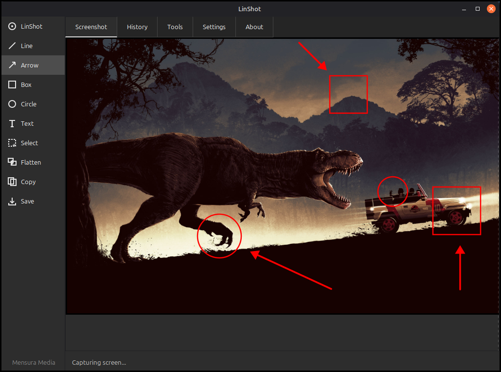
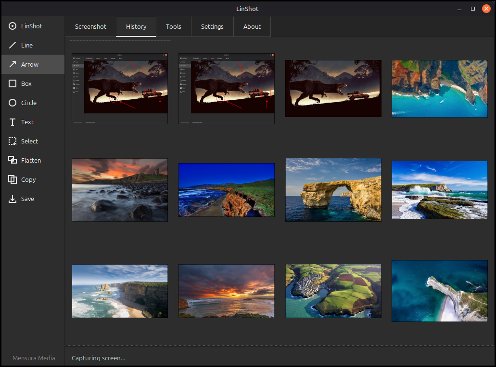
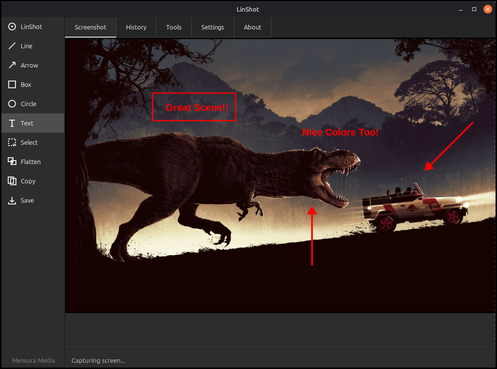

# LinShot

LinShot is a modern, open-source screenshot tool built for Linux Debian-based systems. Capture screenshots with real-time area selection, annotate with a full suite of drawing tools, and browse your image files — all from a clean, dark-themed interface.

**Status:** Beta — actively in development with continual updates.
**Created:** January 2025

## Features

### Annotation Tools
- **Line** — Straight lines with configurable width and color
- **Arrow** — Filled arrows with proportional shaft and head, Shift+drag for 45° snap
- **Box** — Rectangles with configurable width, Ctrl+drag to constrain to square
- **Circle** — Ellipses with configurable width, Ctrl+drag to constrain to circle
- **Text** — Customizable font (18 families), size, bold, italic with live preview
- **Freehand** — Free-form drawing
- **Border** — Decorative double-border frames around selected regions
- **Blur** — Pixelate/mosaic effect to redact sensitive areas, adjustable intensity
- **Marquee Selection** — Select and copy regions with dashed marching-ants box

### Tool Settings
- **Per-Tool Settings** — Independent color palettes, line widths, and shadow options for each tool
- **Universal Setting** — Apply color, width, and shadow to all tools at once with a single checkbox
- **Shadow Effects** — Diffused multi-pass drop shadows with adjustable intensity for all tools
- **Color Swatches** — 12-color circular palette with soft glow selection indicator
- **Text Preview** — Live sample text that updates with font, size, bold, italic, and shadow changes

### Capture & Edit
- **Area Capture** — Click and drag overlay with visual feedback, crosshair cursor, and live dimension display
- **Multi-Paste** — Ctrl+V pastes images as movable overlays; paste multiple times for independent overlays
- **Flatten** — Commit all overlays and annotations permanently into the image
- **Ctrl+Scroll Zoom** — Zoom in/out on the screenshot editor (10%-1000%)
- **Crop** — Draw a region with visual preview and dimensions, crop on release
- **Resize** — Resize by percentage or exact pixel dimensions
- **Rotate / Flip** — Rotate 90/180 degrees, flip horizontal/vertical
- **Brightness / Color** — Adjust brightness, contrast, grayscale, invert colors
- **Multi-Format Support** — Opens and edits PNG, JPG, JPEG, BMP, GIF, WebP, TIFF files
- **Auto Clipboard** — Every capture is automatically copied to clipboard and saved
- **Sequential Save** — Save dialog defaults to configured path with _1, _2, _3 suffix

### Files Tab
- **Image Browser** — Displays all image files from the configured screenshot folder
- **Auto-Refresh** — Detects new files when switching to the Files tab
- **Multi-Select** — Click to select, Ctrl+Click to toggle, Shift+Click for range
- **Delete** — Delete key or Delete button removes selected files from disk (with confirmation)
- **Double-Click** — Opens any image in the screenshot editor for annotation
- **Format Support** — Displays PNG, JPG, JPEG, BMP, GIF, WebP, TIFF thumbnails

### Application
- **Dark Theme** — Consistent dark UI across sidebar, tabs, and all settings
- **System Tray** — Minimize to tray, right-click menu for quick capture
- **Configurable Hotkey** — Set as default screenshot app with PrintScreen remapping
- **Single Instance** — Lock file prevents duplicate launches, signals existing instance
- **Persistent Settings** — All tool colors, widths, shadows, and text options saved between sessions
- **5 Tabs** — Image, Files, Tools, Settings, About

## Screenshots

### Main View


### Files Browser


### Annotation Tools


## Installation

### Build from source

```bash
# Install dependencies (Debian/Ubuntu/Mint)
sudo apt install cmake build-essential libgtk-3-dev libx11-dev libcairo2-dev

# Build
git clone https://github.com/MensuraMedia/linshot3.git
cd linshot3
mkdir build && cd build
cmake -DCMAKE_BUILD_TYPE=Release ..
make

# Run
./linshot
```

### Install .deb package

```bash
# Build the package
bash packaging/build-deb.sh

# Install
sudo dpkg -i linshot_1.0.0_amd64.deb

# Uninstall
sudo apt remove linshot
```

## Keyboard Shortcuts

| Shortcut | Action |
|----------|--------|
| Ctrl+N | New capture |
| Ctrl+S | Save with annotations |
| Ctrl+C | Copy to clipboard (selection or full image) |
| Ctrl+V | Paste from clipboard as movable overlay (multi-paste supported) |
| Ctrl+Z | Undo last annotation |
| Ctrl+A | Select all and copy |
| Ctrl+Scroll | Zoom in/out on screenshot editor |
| Shift+Drag | Snap Line/Arrow to 45° angles |
| Ctrl+Drag | Constrain Box/Circle/Select to square/circle |
| Escape | Clear selection, discard pastes, or cancel capture |
| Delete | Delete selected files (Files tab) or erase selection content |
| PrintScreen | Capture (configurable in Settings) |

## Sidebar Tools

| Tool | Description |
|------|-------------|
| LinShot | Take a new screenshot |
| Line | Draw straight lines |
| Arrow | Draw filled arrows |
| Box | Draw rectangles |
| Circle | Draw ellipses |
| Text | Add text annotations |
| Select | Marquee selection tool |
| Flatten | Commit overlays and annotations to image |
| Copy | Copy image or selection to clipboard |
| Border | Draw decorative double-border frames |
| Blur | Pixelate/mosaic regions to redact content |
| Crop | Draw region to crop image (with live preview) |
| Resize | Resize by percentage or exact dimensions |
| Rotate | Rotate 90/180 degrees, flip horizontal/vertical |
| Bright | Brightness, contrast, grayscale, invert |
| Save | Save image with annotations |

## License

Creative Commons Attribution-NonCommercial 4.0 (CC BY-NC 4.0).
Free for education, research, and personal projects. Commercial use requires permission.

See [LICENSE](LICENSE) for details.

## Repository

[github.com/MensuraMedia/linshot3](https://github.com/MensuraMedia/linshot3)
